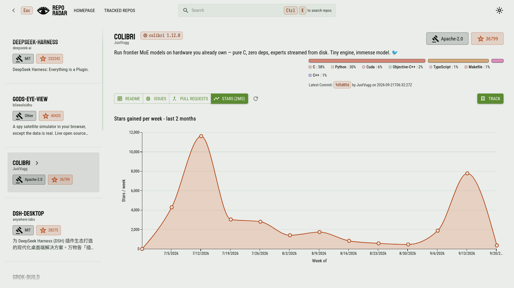
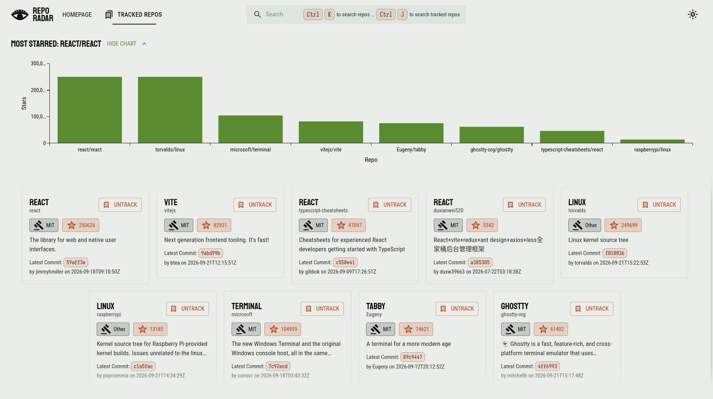
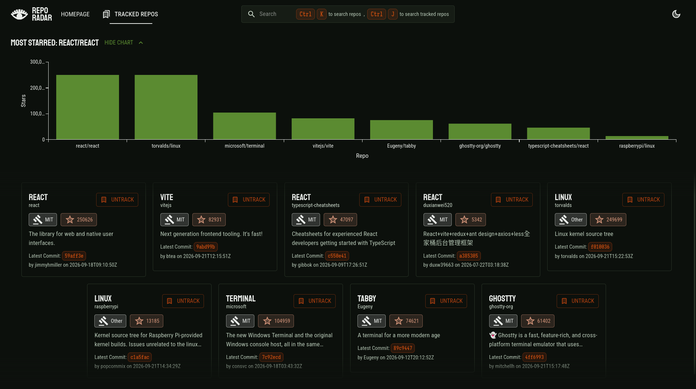
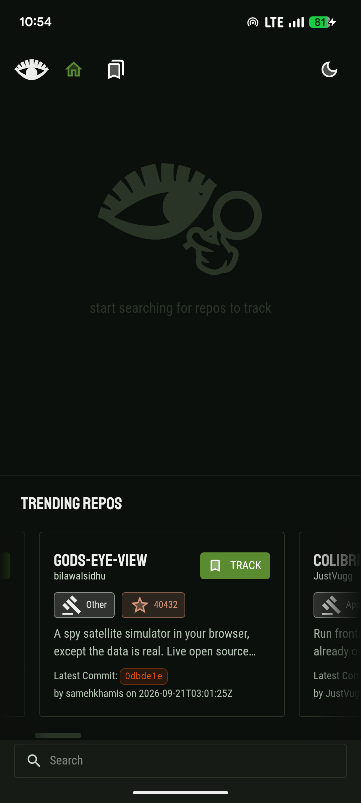
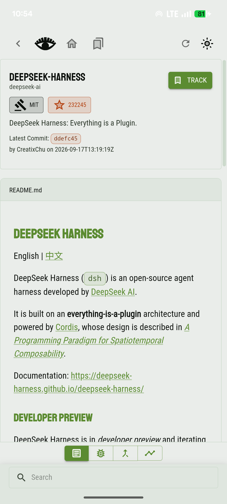
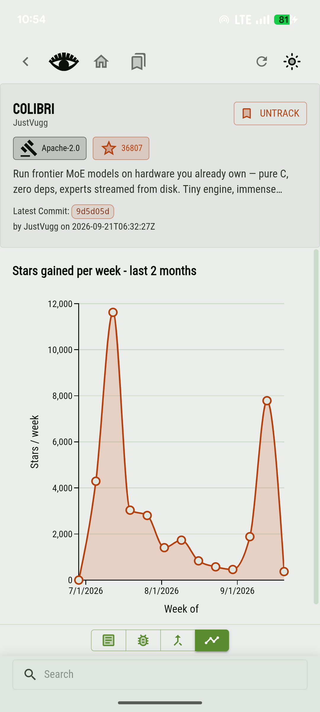
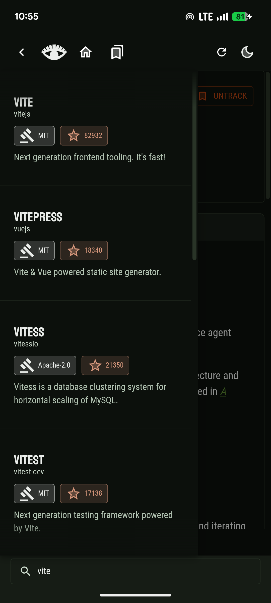

# Repo Radar


# Installation

``` shell
git clone <repo link: SSH/HTTP>
cd repo_radar
```
# Features

- Search GitHub repos and track the ones you want to keep an eye on
- Trending repos: most starred repos created in the last 3 months
- Repo detail view with README, issues, pull requests, and a weekly star history chart
- Language distribution per repo
- Dedicated Tracked Repos page with its own search
- Dark and light theme
- Keyboard shortcuts for search and navigation
- Responsive layout for narrow screens, with its own search panel
- Android app via Capacitor
- Storybook based component library
- Custom 404 page

## Screenshots

<table>
<tr>
<td></td>
<td></td>
<td></td>
</tr>
<tr>
<td></td>
<td></td>
<td></td>
<td></td>
</tr>
</table>

# Local Development

>[!IMPORTANT]
> You need `$VITE_GITHUB_TOKEN` defined in an `.env` in `radar_repo_app`, for a more usable experience with less rate limits
> Configure a *READ ONLY* PAT token as VITE will bundle it with the app
> you can do `set -a && source .env && set +a` for a key value pair env file

Install Dependencies:

``` shell
npm install
```

npm workspaces are set up with `repo_radar_lib` and `repo_radar_app`

First build the component library

``` shell
npm -w repo_radar_lib run build
# optional: run storybook
npm -w repo_radar_lib run storybook
```

Now you can run the app:
``` shell
# dev server
npm -w repo_radar_app run dev
# building
npm -w repo_radar_app run build
```

# Deployment

This is a monorepo architecture with a component lib, what mostly needs to be done on server is:
1. Install dependencies with `npm install`
2. Build Component Lib
3. Build App
4. Serve App

## Vercel Deployment Commands

1. Install Command

``` shell
npm install 
```

2. Build Command
``` shell
npm run build -w repo_radar_lib && npm run build -w repo_radar_app
```

3. Output Directory: `repo_radar_app/dist`

Since Root Directory is the repo root (not `repo_radar_app`), `vercel.json` lives at the repo
root too, with a catch-all rewrite to `index.html` so client-side routes (e.g. `/repos/owner/name`)
don't 404 at Vercel's edge before React Router gets to handle them. `repo_radar_app`'s build also
copies `index.html` to `dist/404.html` as a second fallback, since Vercel serves that file for any
unmatched static path even without a rewrite.

## Android Development

Android/Movile development is done by using capacitor

> Make sure you have `ANDROID_HOME` env var set to Android SDK path

after `npm install` in root repo:

```
npx cap run android
```

# GenAI Usage Transparency

GenAI was used so far to aid in the following:
- Scaffolding Stories/Story Prop Data for Components
- Scaffolding tsx for components
- Making of Simple Components such as `Pill.tsx` or `Button.tsx`
- Moving code around/refactoring maintaining original code essence
- Wrapping SVG assets in SVG Components under `radar_repo_lib/src/components/Icons/`
- Debugging CSS, MUI components and visual errors

Any AI output was reviewed beforehand

--- 

# Architecture
The API to UI component data flow goes through 2-3 layers
Network Layer `client.ts` 
Mapper Layer, just thin middleware to change schemas
Hooks Layer (what components actually use)

## LocalStorage Handling
This is particulary built as an async process in an adapter pattern even though its synchronous:
- This allows the FE to scale/migrate to cloud or a desktop app with a proper DB without a lot of rewriting.

The 'API' is also versioned in code, to protect against stored schema drift 

# Enhancements to requriements
- Trending repos
  - gets the most starred repos that were created in the last 3 months
- Dark/Light Theme
- Search Tracked Repos
- Display Repo Language Distribution
- Display Repo Readme
- Display Repo PRs
- Display Repo Starring rate in the last 6 month as a line chart
- SearchField and Keyboard Shortcuts
- Storybook integration (the website was largely development Component-first)
- Responsive design
  - This Enable Mobile Builds, for IOS and Android using capacitor
- NotFound Page
- Many more QoF enhancements I probably forgot to mention

# Design Decisions
- Not using something like `Zod`: Github API is versioned so no need to validate schema on runtime, using it adds burden to performance computing schema at runtime.
- Not using state management: The scope was honestly small, and Parent heirarchies were clear and manageable, passing props around was the better and kind on the bundle size.
